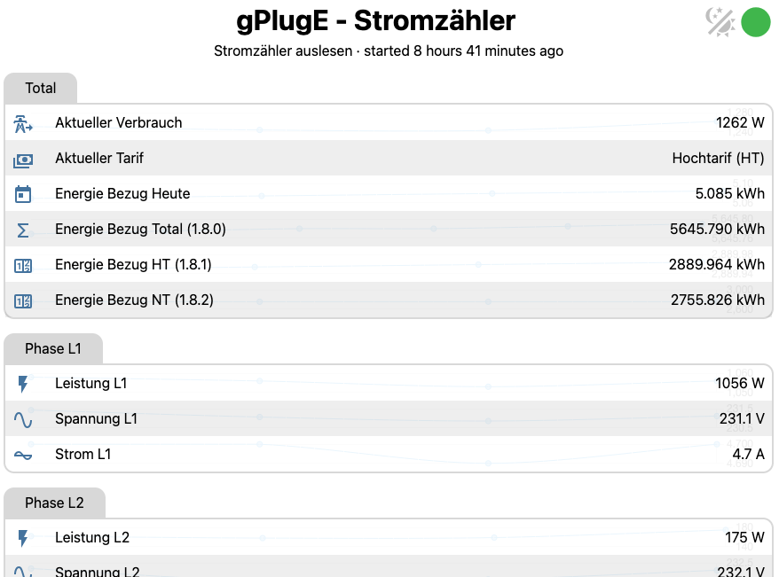

# ESPHome Konfiguration um den Stromzähler mit dem gPlugE IoT-Adapter auszulesen.

Dieses Repository enthält ESPHome-Konfiguration für das **gPlugE** Modul. Basierend auf dem **WT32-ETH01** (ESP32 mit nativem Ethernet) ist dieses Setup speziell für das Auslesen von Smart Metern über die P1-Kundenschnittstelle mittels des DSMR-Protokolls konzipiert.

## 🚀 Warum ESPHome statt Tasmota?
Die Migration von Tasmota zu ESPHome bietet signifikante Vorteile für moderne Smart-Home-Umgebungen:

*   **Native Home Assistant Integration:** Nahtlose Anbindung über das ESPHome-Dashboard; Sensoren erscheinen automatisch mit korrekten Einheiten, Icons und Geräteklassen.
*   **Kein MQTT-Umweg:** Direkte Kommunikation über die native API – das reduziert Latenzen, erhöht die Zuverlässigkeit und macht einen MQTT-Broker überflüssig.
*   **Mächtiges Scripting:** Flexiblere Möglichkeiten zur Datenverarbeitung (Lambdas) direkt auf dem Gerät (z. B. für die Berechnung von Gesamtwerten oder Tarif-Übersetzungen).
*   **Modernes Web-Interface:** Nutzung des Web-Servers v3 mit gruppierter Anzeige für eine übersichtliche Live-Kontrolle direkt im Browser.

## ⚡ Unterstützte & Getestete Hardware
*   **Modul:** [gPlugE (Ethernet-Version)](https://gplug.ch) – Hardware-Basis: WT32-ETH01.
*   **Stromzähler:** [Ensor eRS801](https://www.ensor.com) (Schweizer Standard), sowie kompatible DSMR-Zähler (z.B. Landis+Gyr, Kaifa).
*   **Schnittstelle:** P1-Kundenschnittstelle (RJ12 Anschluss).
*   **Protokoll:** DSMR (Voreingestellt: 115.200 Baud, unverschlüsselt).

## 🛠 Installation & Konfiguration

### 1. Konfigurationsdatei anpassen
Die Hauptdatei ist [gPlugE-DSMR-P1.yaml](configs/gPlugE-DSMR-P1.yaml). In der Regel müssen **keine Änderungen** im eigentlichen Code vorgenommen werden; es reicht aus, wenn die Variablen unter `substitutions` im oberen Bereich der Datei angepasst werden.

### 2. secrets.yaml vorbereiten
ESPHome nutzt eine externe `secrets.yaml` für sensible Daten. Erstelle diese Datei in deinem ESPHome-Verzeichnis mit folgendem Inhalt:

```yaml
# Passwort für den Webserver-Zugriff (Browser-Login)
web_server_password: "DeinSicheresPasswort"

# Das aktuell auf dem Gerät befindliche OTA-Passwort 
# (Bei Erstinstallation nach Tasmota identisch mit ota_password setzen)
gpluge_ota_password: "DeinAltesPasswort"

# Das Passwort, das für zukünftige Updates gesetzt werden soll
ota_password: "DeinNeuesPasswort"

# Der Verschlüsselungsschlüssel für die Home Assistant API (32 Zeichen Base64)
api_key: "DEIN_GENERIERTER_API_KEY"
```
*Hinweis: Die Konfiguration enthält eine Logik, die beim Booten automatisch das OTA-Passwort aktualisiert, falls `ota_password` und `gpluge_ota_password` sich unterscheiden.*

### 3. Flashen der Firmware
Es gibt zwei Wege, um von Tasmota zu ESPHome zu wechseln:

*   **Via Tasmota Web-Interface (OTA):** Du kannst die in ESPHome kompilierte `.bin` Datei direkt im Tasmota-Update-Menü hochladen. 
    *   *Wichtig:* Gib dem Gerät nach dem Upload ca. 2-3 Minuten Zeit. Der ESP32 muss das Dateisystem neu organisieren. Trenne in dieser Zeit nicht den Strom!
*   **Via USB (Empfohlen):** Verbinde das Modul per USB-Seriell-Adapter mit deinem Computer und nutze das [ESPHome Web Tool](https://web.esphome.io), um die Firmware direkt aus dem Browser zu installieren. Dies ist der sicherste Weg, um die korrekte Partitionierung sicherzustellen.

## 📋 Angezeigte Informationen & Sensoren

Folgende Informationen werden vom Stromzähler ausgelesen, im Webinterface des gPlugE dargestellt und nativ an Home Assistant übermittelt.



### 1. Energie-Statistiken
*   **Aktueller Verbrauch (W):** Die aktuelle Last in Watt.
*   **Energie Bezug Total (1.8.0):** Ein berechneter Sensor (Summe aus HT und NT) zur Überwachung des Gesamtzählerstands.
*   **Energie Bezug HT/NT (kWh):** Separate Zählerstände für Hochtarif (1.8.1) und Niedertarif (1.8.2).
*   **Energie Bezug Heute (kWh):** Ein täglicher Summenzähler, der sich automatisch um Mitternacht zurücksetzt.

### 2. Phasen-Analyse (L1, L2, L3)
Für jede der drei Phasen wird separat ausgelesen:
*   **Leistung (W):** Aktuelle Wirkleistung pro Phase.
*   **Spannung (V):** Netzspannung zur Überwachung der Versorgungsqualität.
*   **Strom (A):** Aktuelle Stromstärke pro Phase.

### 3. Netzqualität & Stabilität
*   **Stromausfälle:** Zähler für registrierte lange Stromausfälle.
*   **Spannungsereignisse:** Überwachung von Spannungseinbrüchen (*Sags*) und Spannungsspitzen (*Swells*) pro Phase.
*   **Fehler-Log:** Auslesen des internen Status-Logs des Smart Meters.

### 4. Geräte-Diagnose
*   **Zähler-Identifikation:** Offizielle Identifikationsnummer des Stromzählers.
*   **DSMR-Version:** Version des verwendeten P1-Protokolls.
*   **System-Status:** CPU-Temperatur des ESP32, Uptime des gPlugE sowie Netzwerkdetails (IP- & MAC-Adresse).

## ⚠️ Bekannte Probleme & Hinweise

### 1. Tarif-Erkennung (HT/NT)
Smart Meter geben den aktuellen Tarif über die P1-Schnittstelle oft als numerischen Rohwert aus. Die in dieser Konfiguration hinterlegte Logik übersetzt diese Werte automatisch in Klartext.
*   **Standard-Logik:** In der Regel entspricht Rohwert `0002` dem Hochtarif (HT) und `0001` dem Niedertarif (NT).
*   **Anpassung:** Sollte Ihr Zähler abweichende Werte senden (z. B. `5432` / `5431`), zeigt das Webinterface "Unbekannter Tarif" an. In diesem Fall muss der Rohwert im YAML-Skript unter `text_sensor` im entsprechenden `lambda`-Block angepasst werden (was in meinem Fall für `5432` / `5431` durchgeführt wurde).

### 2. Konnektivität & Stabilität
*   **Reiner Ethernet-Betrieb:** Diese Konfiguration ist auf den Betrieb über das LAN-Kabel optimiert. WLAN ist bewusst deaktiviert, um eine maximale Verbindungsstabilität zu garantieren.

### 3. P1-Schnittstelle & Pegel
*   **Invertierung:** Je nach Zählermodell und verwendetem Lesekopf muss das Signal invertiert werden. Die Konfiguration nutzt den Standard-UART-Modus. Sollten keine Daten ankommen, prüfen Sie, ob Ihr Lesekopf eine Hardware-Invertierung besitzt oder ob der `rx_pin` im YAML auf `inverted: true` gesetzt werden muss.
*   **Baudrate:** Der Standard für DSMR ist 115.200 Baud. Ältere Zähler (z. B. nach DSMR 2.x oder 3.x Standard) benötigen eventuell eine Reduktion auf 9.600 Baud.

## 🤝 Beteiligung
Solltet ihr einen anderen gPlug oder Stromzähler im Einsatz und die ESPHome Konfiguration dazu erstellt haben, könnt/sollt/dürft ihr diese gerne hier teilen. Entweder als Pull-Request oder ihr schickt es mir per Email an `haribert`at`gmx`dot`ch`, dann nehme ich diese unter `configs` auf.

## 🔗 Relevante Ressourcen & Links
*   **Hersteller gPlug:** [gplug.ch](https://gplug.ch)
*   **Ensor Smart Meter Produkte:** [ensor.com](https://www.ensor.com)
*   **ESPHome Dokumentation:** [DSMR Sensor](https://esphome.io) | [Ethernet Component](https://esphome.io)
*   **Tasmota Dokumentation:** [SML Interface](https://tasmota.github.io) (für Vergleichszwecke)

